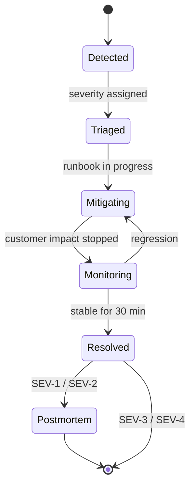

# Incident response

Use this process for anything that affects customers using a kiosk.

## The first 10 minutes

- [ ] **Acknowledge** the page or ticket so others know someone has it.
- [ ] **Assess the scope.** How many kiosks and sites are affected? Is it one kiosk, one site, or the whole fleet?

    ```bash
    kioskctl fleet status --unhealthy
    ```

- [ ] **Assign a severity** using the [severity matrix](severity.md). If you're unsure, pick the higher one.
- [ ] **Open an incident channel** named `#inc-YYYYMMDD-short-name` and post the initial summary.
- [ ] **Name an Incident Commander (IC).** For SEV-1 and SEV-2, the IC does not also debug.
- [ ] **Open the matching runbook** from the [runbook index](../runbooks/index.md).
- [ ] **Communicate.** Post a status page update for SEV-1 and SEV-2 within 15 minutes. See [Customer communication](communication.md).

## Roles

| Role | Responsibility |
| --- | --- |
| **Incident Commander** | Owns the incident, makes decisions, keeps the timeline, runs updates |
| **Ops lead** | Hands on keyboard. Follows the runbooks and reports findings to the IC |
| **Comms lead** | Status page, customer success managers, internal stakeholders |
| **Scribe** | Keeps the timeline in the incident channel (optional for SEV-3/4) |

## Lifecycle



!!! tip "Mitigate first, investigate later"
    Restoring service comes first. Rolling back, restarting or failing over is fine even if you don't yet know the root cause. Capture logs *before* a destructive action when you can do it in under two minutes.

## After the incident

- Resolve the status page entry and notify customer success managers.
- For SEV-1 and SEV-2, the IC schedules a blameless postmortem within **5 business days**.
- File follow-up tickets with the `incident-followup` label and link them to the postmortem.
- If a runbook was wrong or missing, update it. See [Contributing](../contributing/index.md).
