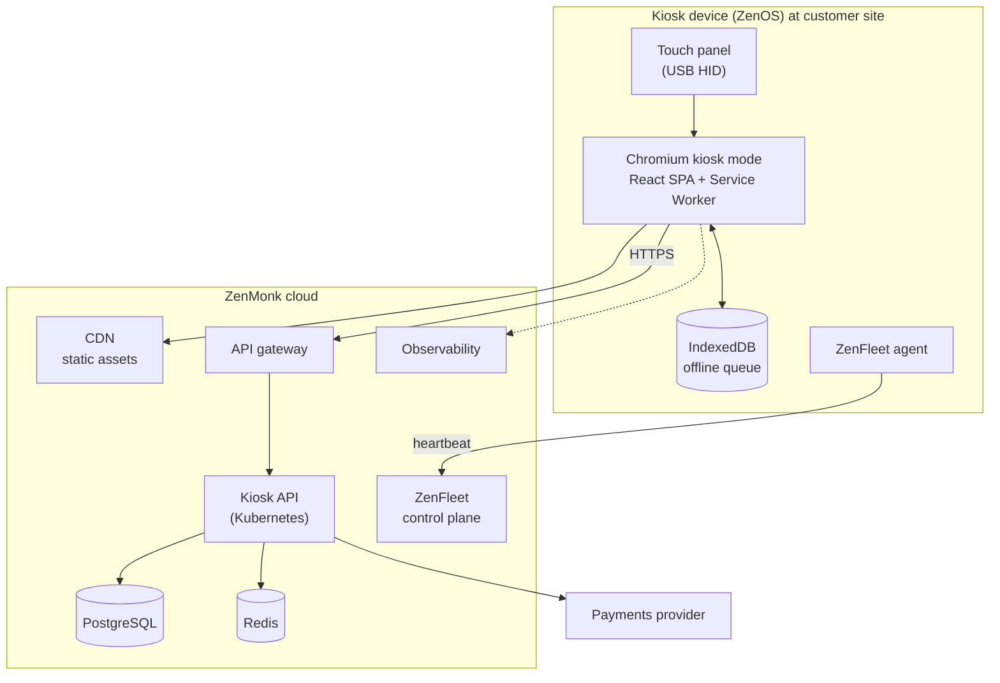
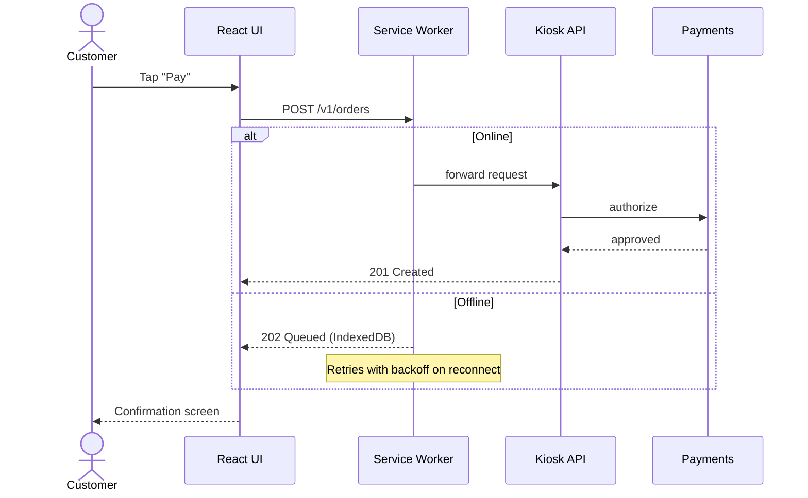

# Architecture

## Component diagram

## Components

### Kiosk device

- **Hardware:** 21.5" or 32" projected-capacitive touch panel connected over USB HID, fanless x86 or ARM PC, wired Ethernet with LTE failover on some sites.
- **OS:** ZenOS, an immutable Linux image. Chromium launches in `--kiosk` mode under a systemd user service, `kiosk-ui.service`.
- **ZenFleet agent:** reports a heartbeat every 60 seconds, ships logs, and runs remote commands issued with [`kioskctl`](../reference/kioskctl.md).

### Frontend (React SPA)

- Built with Vite. Assets are content-hashed and served from the CDN.
- A **service worker** pre-caches the app shell, so the UI still loads while the kiosk is offline.
- Transactions created while offline go into an **IndexedDB queue** and sync when the kiosk reconnects.
- A top-level React **error boundary** shows a friendly "Tap to restart" screen and reports the error to observability.
- An **idle watchdog** returns the UI to the attract screen after 90 seconds with no touch input.

### Backend

- **API gateway:** handles TLS termination, per-kiosk auth using device certificates, and rate limiting.
- **Kiosk API:** a stateless service running on Kubernetes (3–12 pods, autoscaled).
- **PostgreSQL:** the system of record. **Redis:** caches catalog data and sessions.
- **Payments provider:** an external dependency with its own status page.

## Request flow: customer checkout

!!! note "Offline payments"
    Card payments cannot complete offline. In offline mode the UI hides card payment and offers only "pay at counter" orders. This is expected behavior, not a bug.
