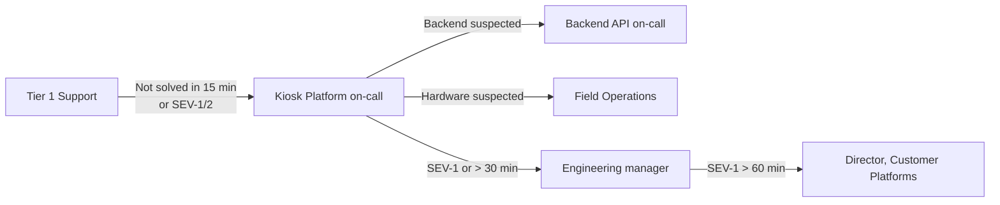

# Contacts & escalation

!!! warning "Demo content"
    All names, numbers and channels below are fictional.

## On-call rotations

| Rotation | Covers | Page via | Hours |
| --- | --- | --- | --- |
| **Kiosk Platform (primary)** | React app, releases, ZenFleet | `#kiosk-oncall` / pager service `kiosk-platform` | 24 × 7 |
| **Backend API** | Kiosk API, database, cache | pager service `kiosk-api` | 24 × 7 |
| **Field Operations** | On-site hardware, cabling, panel swaps | Field Ops dispatch desk | 07:00–22:00 local |
| **Customer Support (Tier 1)** | Customer calls, ticket triage | Support queue `KIOSK` | 24 × 7 |

## Escalation path

## Vendors

| Vendor | For | Support contact | Contract ID |
| --- | --- | --- | --- |
| PanelCo | Touch panels, controllers | `support@panelco.example` | PC-88213 |
| NetEdge | Site LTE failover | `noc@netedge.example` | NE-4410 |
| PayFlow | Card payments | Status: `https://status.payflow.example` | PF-ENT-022 |
| EdgeCDN | Static asset delivery | `https://support.edgecdn.example` | EC-7719 |
