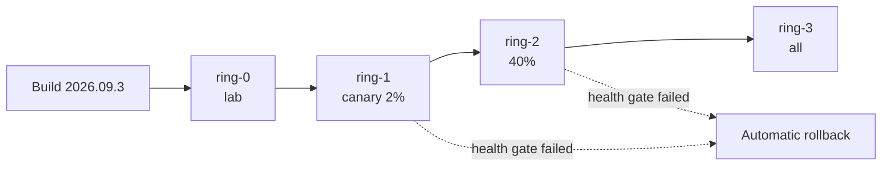

# Deploy & rollback

| | |
| --- | --- |
| **Owner** | Kiosk Platform |
| **Typical severity** | SEV-2 when a rollback is needed |
| **Alert(s)** | `ReleaseCanaryFailed`, `FrontendErrorRateHigh` |
| **Last reviewed** | 2026-09-27 by Kiosk Platform |
| **Est. time to mitigate** | 10 min (rollback) |

## How releases work

Web releases of the React app are **immutable builds** (`YYYY.MM.N`) pushed to the CDN. Kiosks pick up a new version only when their **ring** is pointed at it. Nothing is overwritten in place, so rolling back just repoints a ring.

| Ring | Kiosks | Soak time before next ring |
| --- | --- | --- |
| `ring-0` (lab) | 10 lab kiosks | 1 h |
| `ring-1` (canary) | ~2 % of the fleet, low-traffic sites | 24 h |
| `ring-2` | ~40 % of the fleet | 24 h |
| `ring-3` | Everything else | — |



## Deploy

1. **Check that the release is safe to promote:**

    ```bash
    kioskctl release list --limit 3
    kioskctl release health 2026.09.3 --ring ring-1
    ```

    Promote only if the health gate reports `PASS`: UI health failures, error rate and tap-to-response are all within 10 % of the previous release.

2. **Promote to the next ring:**

    ```bash
    kioskctl release promote 2026.09.3 --ring ring-2 --change CHG-10482
    ```

3. **Watch the release for 30 minutes** on the fleet dashboard, filtered by `app_version`.

!!! note "Freeze windows"
    Don't promote to `ring-2` or `ring-3` on Fridays after 12:00 local time, or during customer peak events (see the release calendar), unless the change is an approved hotfix.

## Roll back

Roll back **first** and investigate afterwards when:

- UI health failures or the error rate rise within 2 hours of a promotion, **or**
- An incident is open and the most recent change was a release.

1. **Repoint the affected ring(s)** to the previous known-good version:

    ```bash
    kioskctl release rollback --ring ring-2 --to 2026.09.2 --reason "INC-2217 white screen"
    ```

    Kiosks pick up the change the next time they check (within 60 seconds) and reload when idle.

2. **Force idle kiosks to reload now** (they're skipped if a customer session is active):

    ```bash
    kioskctl app restart --ring ring-2 --when idle
    ```

3. **Kiosks stuck on the bad version** (usually because of a service worker cache):

    ```bash
    kioskctl cache clear --ring ring-2 --version 2026.09.3 --scope service-worker
    ```

4. **Block the bad version** so nobody promotes it by accident:

    ```bash
    kioskctl release block 2026.09.3 --reason "INC-2217"
    ```

## Verify

- [ ] `kioskctl fleet status --group-by app_version` shows no kiosks left on the bad version (allow 10 min)
- [ ] UI health and error rate are back to baseline
- [ ] The incident channel has been updated with the rollback time

## Related

- [White screen / app crash](white-screen.md)
- [Incident response](../incidents/index.md)
