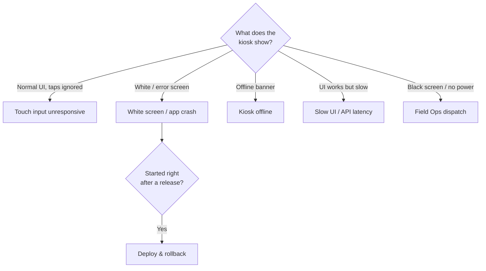

# Runbooks

Find the runbook by the **symptom** you are seeing. Each runbook follows the same structure: *Symptoms → Impact → Diagnose → Mitigate → Verify → Escalate*.

| Runbook | Symptom | Typical severity | Est. time to mitigate |
| --- | --- | --- | --- |
| [Touch input unresponsive](touch-unresponsive.md) | Screen displays normally but taps do nothing or land in the wrong place | SEV-3 | 10 min |
| [White screen / app crash](white-screen.md) | Blank white screen, "Something went wrong" screen, or a crash loop | SEV-2 | 15 min |
| [Kiosk offline](kiosk-offline.md) | Offline banner, heartbeat missing, orders queued | SEV-3 | 20 min |
| [Slow UI / API latency](slow-ui.md) | Spinners, slow screen transitions, timeouts at checkout | SEV-2 | 30 min |
| [Deploy & rollback](deploy-rollback.md) | Rolling out a web release, or reverting a bad one | SEV-2 | 10 min |

!!! tip "No runbook fits?"
    Follow the general [incident process](../incidents/index.md), then write the missing runbook from the [template](../contributing/runbook-template.md) once the incident is over.

## Quick triage

